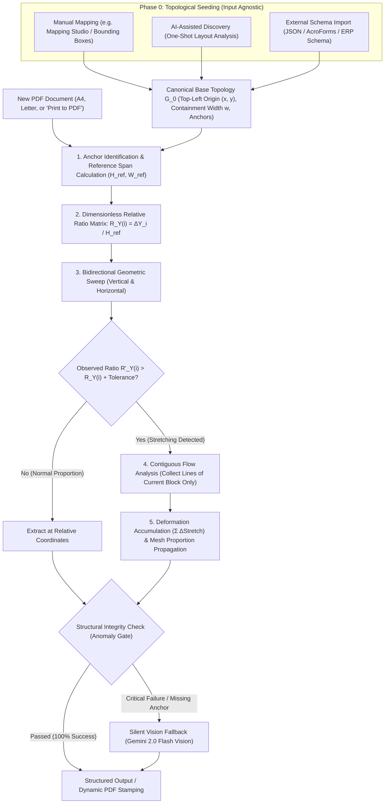

# DocMapper

High-performance client-side engine for deterministic spatial extraction, visual mapping, and dynamic stamping of logistics, shipping, and fiscal documents in the browser.

---

## Levi's Scale-Invariant Extraction (LSIE)

Created by **Levi Silveira**, the **Levi's Scale-Invariant Extraction (LSIE)** algorithm is a deterministic geometric method featuring bidirectional scanning and relative-proportion elastic deformation, designed specifically to solve the **Reflowable Layout (*Vertical & Horizontal Drift*)** problem in freight, shipping, customs, and billing documents.

---

### What is LSIE Used For?

In structured and semi-structured documents (such as CMRs, commercial invoices, packing lists, and bills of lading), traditional extraction systems relying on fixed coordinate grids frequently fail due to three critical factors:

1. **Dynamic Content Expansion (Accordion Effect):**
   - Fields such as *Consignment Numbers* or *Goods Descriptions* may contain a single line in one document and 10+ lines in another.
   - When a field expands, it pushes all subsequent sections and fields downward ($\Delta Y > 0$).
2. **Scale Invariance and Virtual Printers:**
   - Documents generated via *"Print to PDF"*, converted to *Letter* instead of *A4*, or scanned with variable margins suffer scaling changes and offset shifts.
   - While absolute distances (pixels, points, or millimeters) change, the **relative geometric composition** between fields remains strictly invariant.
3. **Prevention of Field Contamination (Zero Data Leakage):**
   - If a user maps only 2 fields across a 50-field document (e.g., a header code at the top and the trailer plate at the footer), a naive extractor expanding downward to the next anchor would indiscriminately swallow all unmapped goods descriptions, weights, and dimensions in between.
   - LSIE isolates the contiguous flow of the field's own lines, guaranteeing **zero leakage** into unmapped sections.

**LSIE** solves these challenges with local in-browser processing in **~5 milliseconds**, **zero external API calls**, **$0.00 execution cost**, and complete client-side privacy (**100% compliant with GDPR and LGPD**).

---

### Algorithm Architecture and Flow

LSIE operates in two primary stages: **Topological Initialization (Phase 0)** — which defines the initial geometry of the target fields — and the **Elastic Resolution Cycle (Phases 1 to 5)**, executed in real time for each document.

---

### Mathematical Formulation of LSIE

#### 0. Phase 0: Topological Seeding (Canonical Geometry Input)
LSIE is **strictly agnostic to the coordinate discovery or measurement method**. The algorithm does not depend on any specific user interface: any operator, automated system, or script can capture the baseline coordinates through whatever mechanism is preferred (manual pixel measurement, interactive canvas click-and-drag, PDF stream inspection, Python/OpenCV scripts, annotation tools like Label Studio, or one-shot LLM layout extraction).

The core requirement of LSIE is receiving the initial field geometry anchored by its **primary origin coordinate: the top-left corner $(x, y)$**:

$$\mathcal{G}_0 = \{ (F_i, B_i, A_i) \}_{i=1}^n$$
Where:
- $F_i$: Semantic field identifier (e.g., `consignments`, `trailer_plate`, `shipper_name`).
- $B_i = (x, y, w, h) \in [0, 1]^4$: 
  - **$(x, y)$ — Primary Coordinate (Top-Left Corner):** The canonical anchor point of the field. By Western reading convention and vector typography rendering, text begins at the top-left vertex. Because dynamic content stretching propagates downward ($+Y$) and rightward ($+X$), the top-left corner remains the stable reference point from which textual flow originates.
  - **$(w, h)$ — Spatial Channel Boundaries:** The width $w$ defines the horizontal containment channel (preventing cross-column intrusion into neighboring sections), and $h$ defines the nominal starting height of the first line.
- $A_i$: Contextual label or anchor text (e.g., `"Consignment no"`, `"Trailer No:"`), used to guide relative landmark calibration.

Once provided with this canonical initial mesh $\mathcal{G}_0$, LSIE deterministically resolves all subsequent elastic documents.

#### 1. Scale Invariance via Dimensionless Ratios
Let $A_1, A_2, \dots, A_k$ be known anchors ordered vertically by their design $Y$-coordinates.  
The **Vertical Reference Span** is defined as:
$$H_{\text{ref}} = Y(A_k) - Y(A_1)$$

And the **Horizontal Reference Span** is defined as:
$$W_{\text{ref}} = X(A_{\text{right}}) - X(A_{\text{left}})$$

For any consecutive interval $i$ between anchors $A_i$ and $A_{i+1}$, the **Dimensionless Relative Ratio** is calculated as:
$$R_{Y}(i) = \frac{Y(A_{i+1}) - Y(A_i)}{H_{\text{ref}}}, \quad \text{where } \sum_{i=1}^{k-1} R_Y(i) = 1.0$$

Because $R_Y(i)$ and $R_X(j)$ are pure dimensionless ratios, they are **strictly invariant to screen resolutions, scan DPIs, page formats (Letter vs. A4), and virtual printer margin offsets**.

#### 2. Detection and Localization of Local Deformations
In the active document being processed, the observed physical coordinates $Y'(A_i)$ and $H'_{\text{ref}}$ are measured.  
The observed interval ratio is computed as:
$$R'_{Y}(i) = \frac{Y'(A_{i+1}) - Y'(A_i)}{H'_{\text{ref}}}$$

If $R'_Y(i) - R_Y(i) > \tau$ (where $\tau \approx 0.02$, or 2% of the span), the algorithm diagnoses:
- **Localization:** Interval $i$ experienced dynamic content expansion.
- **Absolute Observed Deformation:**
  $$\Delta\text{Stretch}_Y(i) = (R'_Y(i) - R_Y(i)) \times H'_{\text{ref}}$$

The exact same formulation is applied along the horizontal axis for columns that expand horizontally ($\Delta\text{Stretch}_X$).

#### 3. Contiguous Flow Analysis (*Zero Leakage*)
For fields contained within a deformed interval (such as *Consignments*):
- Extraction **only begins** if the first text glyph intersects the original starting bounding box ($Y_{\text{start}}$), preventing empty fields from capturing unrelated lower sections.
- The algorithm clusters contiguous text lines sharing the same horizontal channel with a uniform line pitch:
  $$\text{Pitch} \le 1.6 \times \text{LineHeight}$$
- Extraction immediately terminates at the first blank whitespace gap larger than the standard line pitch, **completely preventing contamination of unmapped intermediate sections**.

#### 4. Mesh Propagation and Relative Proportion Preservation
For any subsequent field $m$ positioned below one or more stretched regions:
$$Y_{\text{actual}}(m) = (Y_{\text{original}}(m) \times S_y) + \sum_{j < m} \Delta\text{Stretch}_Y(j)$$

The relative spatial distances between all subsequent non-deformed fields remain mathematically identical to the original template design.

---

### Silent Safety Fallback: *Anomaly Gate*

If a document experiences catastrophic structural deformation that violates geometric integrity (such as an essential anchor truncated during scanning or an alien layout):
1. The engine silently activates **Gemini 2.0 Flash Vision**.
2. The page is rendered in-memory as an optimized image and parsed via multimodal computer vision.
3. The extracted fields are merged **100% transparently to the user**, requiring zero manual intervention or workflow interruption.

---

### LSIE Advantages in DocMapper

| Metric | Traditional Extractors | LSIE (Levi's Scale-Invariant Extraction) |
| :--- | :--- | :--- |
| **Execution Time** | ~200ms - 2s | **~5 milliseconds per page** |
| **Cost per Document** | $0.01 to $0.05 | **$0.00 (100% Free on Client)** |
| **Data Privacy** | PDFs transmitted to 3rd-party clouds | **Fully Offline (100% GDPR & LGPD Compliant)** |
| **Elastic Layout Support** | Fails when fields expand | **Automatic elastic correction & proportion preservation** |
| **Printer Scale Sensitivity** | Fails on Letter vs. A4 | **100% Invariant to Scale & Margins** |
