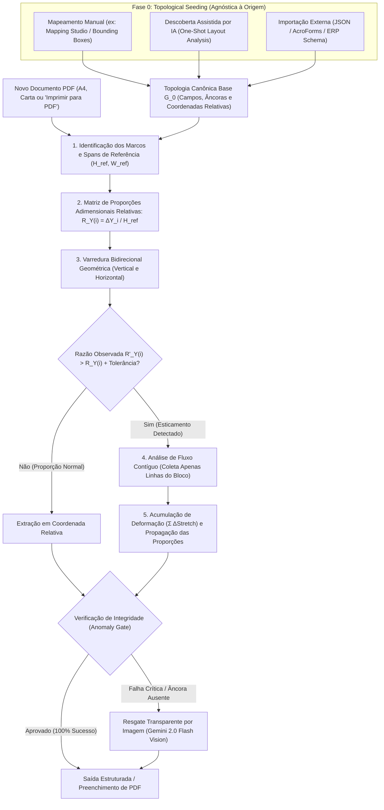

# Copyx

Motor de alto desempenho para extração espacial determinística, mapeamento visual e preenchimento dinâmico de documentos fiscais e logísticos no navegador.

---

## Levi's Scale-Invariant Extraction (LSIE)

Criado por **Levi Silveira**, o algoritmo **Levi's Scale-Invariant Extraction (LSIE)** é um método geométrico determinístico de varredura bidirecional e deformação elástica por proporções relativas, desenvolvido especificamente para resolver o problema de **Layout Elástico (*Reflowable Layout / Vertical & Horizontal Drift*)** em documentos de transporte, frete e faturamento.

---

### Para que serve o LSIE?

Em documentos estruturados (como CMRs, faturas comerciais, romaneios de carga e conhecimentos de transporte), sistemas de extração tradicionais baseados em coordenadas fixas falham frequentemente devido a três fatores críticos:

1. **Expansão Dinâmica de Conteúdo (Efeito Sanfona):**
   - Campos como *Consignment Numbers* ou *Descrição de Mercadorias* podem conter 1 linha em um documento e 10 linhas em outro.
   - Quando um campo expande, ele empurra todas as seções e campos abaixo dele para posições verticais inferiores ($\Delta Y > 0$).
2. **Invariância de Escala e Dispositivo de Impressão:**
   - Documentos gerados via *"Imprimir para PDF"*, convertidos para papel *Carta (Letter)* em vez de *A4*, ou digitalizados com margens de impressão sofrem reduções de escala e deslocamentos de margem.
   - Embora as distâncias absolutas (pixels ou milímetros) mudem, a **composição geométrica relativa** entre os campos permanece rigorosamente a mesma.
3. **Prevenção de Contaminação entre Campos:**
   - Se o usuário mapeou apenas 2 campos de um formulário de 50 campos (por exemplo, um código no topo e a placa do caminhão no rodapé), um extrator ingênuo que expanda até a próxima âncora "engoliria" todas as descrições de mercadorias, pesos e cubagens não mapeadas intermediárias.
   - O LSIE delimita o fluxo contíguo das linhas do próprio campo, garantindo **zero vazamento**.

O **LSIE** resolve esses desafios com processamento local em **~5 milissegundos**, **zero chamadas de API externas**, custo **R$ 0,00** e privacidade total no cliente (**100% aderente a LGPD e GDPR**).

---

### Arquitetura e Fluxo do Algoritmo

O LSIE opera em duas grandes etapas: a **Inicialização Topológica (Fase 0)** — que define a geometria dos campos de interesse — e o **Ciclo de Resolução Elástica (Fases 1 a 5)**, executado em tempo real para cada documento.

---

### Formulação Matemática do LSIE

#### 0. Fase 0: Topological Seeding (Entrada de Geometria Canônica)
O algoritmo é **desacoplado do método de demarcação inicial**. Ele aceita como entrada uma tupla topológica canônica:
$$\mathcal{G}_0 = \{ (F_i, B_i, A_i) \}_{i=1}^n$$
Onde:
- $F_i$ é o identificador semântico do campo (ex: `consignments`, `trailer_plate`, `shipper_name`).
- $B_i = (x, y, w, h) \in [0, 1]^4$ são as coordenadas relativas normalizadas da caixa no documento gabarito.
- $A_i$ é o texto contextual da âncora mais próxima (ex: `"Consignment no"`, `"Trailer No:"`), usado para guiar a calibração de marcos.

Essa geometria inicial pode ser obtida por:
1. **Demarcação Manual Direta:** O usuário desenha as caixas interativamente sobre uma página modelo.
2. **Descoberta Automática / Heurística:** Modelos de visão (OCR + detecção de tabelas/linhas) geram os retângulos automaticamente.
3. **Esquema Importado:** Qualquer sistema terceiro que possua um arquivo de coordenadas pode alimentar o LSIE diretamente.

Uma vez fornecido $\mathcal{G}_0$, o LSIE constrói a malha elástica descrita a seguir.

#### 1. Invariância de Escala por Proporções Adimensionais
Sejam $A_1, A_2, \dots, A_k$ as âncoras conhecidas ordenadas verticalmente pelo seu $Y$ de design.  
Define-se o **Span de Referência Vertical**:
$$H_{\text{ref}} = Y(A_k) - Y(A_1)$$

E o **Span de Referência Horizontal**:
$$W_{\text{ref}} = X(A_{\text{dir}}) - X(A_{\text{esq}})$$

Para qualquer intervalo consecutivo $i$ entre as âncoras $A_i$ e $A_{i+1}$, calcula-se a **Razão Relativa Adimensional**:
$$R_{Y}(i) = \frac{Y(A_{i+1}) - Y(A_i)}{H_{\text{ref}}}, \quad \text{onde } \sum_{i=1}^{k-1} R_Y(i) = 1.0$$

Como $R_Y(i)$ e $R_X(j)$ são razões adimensionais puras, elas são **estritamente invariantes a resoluções de tela, DPIs de escaneamento, formatos de página (Letter vs A4) e margens de impressoras virtuais**.

#### 2. Detecção e Localização de Deformações Locais
No documento real sendo processado, as posições reais observadas $Y'(A_i)$ e $H'_{\text{ref}}$ são medidas.  
Calcula-se a razão real do intervalo:
$$R'_{Y}(i) = \frac{Y'(A_{i+1}) - Y'(A_i)}{H'_{\text{ref}}}$$

Se $R'_Y(i) - R_Y(i) > \tau$ (onde $\tau \approx 0.02$, ou 2% do span), o algoritmo diagnostica:
- **Localização:** O intervalo $i$ sofreu esticamento elástico de conteúdo.
- **Deformação Absoluta Observada:**
  $$\Delta\text{Stretch}_Y(i) = (R'_Y(i) - R_Y(i)) \times H'_{\text{ref}}$$

O mesmo cálculo é executado no eixo horizontal para colunas que alargam ($\Delta\text{Stretch}_X$).

#### 3. Coleta de Conteúdo Contíguo (*Contiguous Flow*)
Para o campo contido no intervalo que deformou (como *Consignments*):
- O campo **só inicia** se o primeiro glifo de texto intersectar os limites da sua caixa de partida ($Y_{\text{start}}$), evitando que campos vazios capturem seções inferiores.
- O algoritmo agrupa as linhas contíguas da mesma coluna que mantêm entrelinha uniforme:
  $$\text{Pitch} \le 1.6 \times \text{LineHeight}$$
- A coleta é finalizada no primeiro salto de espaço em branco maior que a entrelinha normal, **impedindo a contaminação de seções intermediárias não mapeadas**.

#### 4. Propagação de Malha e Preservação de Proporções
Para qualquer campo subjacente $m$ localizado abaixo de um ou mais esticamentos:
$$Y_{\text{real}}(m) = (Y_{\text{original}}(m) \times S_y) + \sum_{j < m} \Delta\text{Stretch}_Y(j)$$

As distâncias relativas entre todos os campos não deformados subsequentes continuam exatamente as mesmas do desenho original.

---

### Camada de Resgate Transparente: *Anomaly Gate*

Caso um documento sofra uma deformação catastrófica que viole a integridade geométrica (por exemplo: âncora obrigatória cortada na digitalização ou layout alienígena):
1. O motor aciona silenciosamente o **Gemini 2.0 Flash Vision**.
2. A página é renderizada em memória como imagem leve e analisada via visão computacional multimodal.
3. O resultado é mesclado de forma **100% transparente para o usuário**, sem interrupções nem necessidade de configuração manual.

---

### Benefícios do LSIE no Copyx

| Critério | Extratores Tradicionais | LSIE (Levi's Scale-Invariant Extraction) |
| :--- | :--- | :--- |
| **Tempo de Execução** | ~200ms - 2s | **~5 milissegundos por página** |
| **Custo por Documento** | R$ 0,05 a R$ 0,25 | **R$ 0,00 (100% Gratuito no Cliente)** |
| **Privacidade de Dados** | Envio de PDFs para nuvens terceiras | **Totalmente Offline (Aderente à LGPD/GDPR)** |
| **Suporte a Layout Elástico** | Quebra quando campos expandem | **Auto-correção elástica e preservação de proporções** |
| **Sensibilidade a Impressoras** | Quebra em Carta vs A4 | **100% Invariante a Escala e Margens** |
