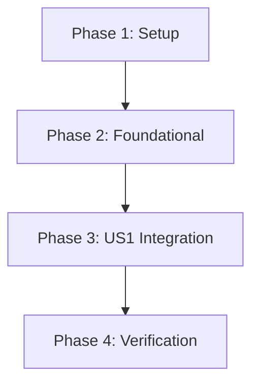

# Task Breakdown: App-Level Licensing (Legal Shield)

**Feature Branch**: `004-app-licensing`
**Spec**: [spec.md](file:///c:/Users/guilh/source/repos/Copyx/specs/004-app-licensing/spec.md)
**Plan**: [plan.md](file:///c:/Users/guilh/source/repos/Copyx/specs/004-app-licensing/plan.md)

## Overview

This document provides an actionable, dependency-ordered task list for implementing the "Legal Shield" license verification system. The feature ensures that the application verifies its license key with a backend server before loading critical WASM modules, preventing unauthorized usage.

**Total Estimated Tasks**: 22
**User Stories**: 1 (US1: License Verification)
**MVP Scope**: Complete Phase 1-3 (all phases required for core functionality)

---

## Implementation Strategy

- **MVP First**: Phases 1-3 deliver the core license verification functionality
- **Incremental Delivery**: Each phase is independently testable
- **Parallel Opportunities**: Tasks marked with [P] can be executed in parallel with other [P] tasks in the same phase

---

## Phase 1: Setup & Infrastructure

**Goal**: Initialize backend infrastructure and configuration for license verification.

### Tasks

- [x] T001 Create feature branch `004-app-licensing` from main
- [x] T002 [P] Initialize backend package.json in `backend/package.json` with express, cors, dotenv, typescript dependencies
- [x] T003 [P] Create backend tsconfig.json in `backend/tsconfig.json` with Node.js configuration
- [x] T004 [P] Create environment variable examples in `.env.example` (VITE_LICENSE_KEY, VITE_LICENSE_SERVER)
- [x] T005 Install backend dependencies via `npm install` in backend directory
- [x] T005A Install `sqlite3` and `@types/sqlite3` in backend

---

## Phase 2: Foundational Logic

**Goal**: Implement core backend license verification API and frontend service infrastructure.

**Blocking Prerequisites**: Phase 1 must be complete.

### Backend Implementation

- [x] T006 [P] Create backend entry point in `backend/src/index.ts` with Express server setup, CORS config, and environment loading
- [x] T006A Implement database initialization in `backend/src/db.ts` (create `licenses` table if missing)
- [x] T006B Create seed script `backend/src/seed.ts` to add initial test entry
- [x] T007 Implement license verification route in `backend/src/routes/license.ts` with POST /api/verify endpoint (Query SQLite)
- [x] T008 [DELETED] Add license validation logic to parse VALID_KEYS env var (Replaced by DB query)
- [x] T008A [P] Add key format validation in `backend/src/routes/license.ts` to verify keys start with `cpx_live_` prefix and return HTTP 400 for invalid format

### Frontend Service Layer

- [x] T009 [P] Create LicenseService singleton in `frontend/src/services/license-service.ts` with verify() method and retry logic (3 attempts with 1-second delay)
- [x] T010 [P] Add license caching mechanism in `frontend/src/services/license-service.ts` with isLicenseValid() method

---

## Phase 3: User Story 1 - License Verification Integration

**Story**: As a product owner, I want the application to verify its license key with a central server on startup, so that unauthorized copies are disabled.

**Priority**: P1 (Critical - Blocking)

**Independent Test Criteria**:
- ✅ Valid license allows app initialization and WASM loading
- ✅ Invalid license shows blocking error screen and prevents WASM load
- ✅ Network failure (3 retries) blocks access with appropriate error message

### Tasks

- [x] T011 [US1] Modify WasmService to check license before initialization in `frontend/src/services/WasmService.ts`
- [x] T012 [US1] Add license failure error handling in `frontend/src/services/WasmService.ts` (throw "Security Module Missing" error)
- [x] T013 [US1] Update main.ts app entry point in `frontend/src/main.ts` to call LicenseService.verify() before Vue mount
- [x] T014 [US1] Implement blocking error UI in `frontend/src/main.ts` for invalid license (overwrites #app innerHTML)
- [x] T015 [US1] Add conditional Vue app mounting logic based on license validation result in `frontend/src/main.ts`

---

## Phase 4: Verification & Testing

**Goal**: Verify all acceptance scenarios and ensure production readiness.

**Dependencies**: Phase 3 must be complete.

### Manual Verification Tasks

- [x] T016 [US1] Configure test environment variables for backend and Run Seed Script (`npm run seed`)
- [x] T017 [US1] Test Scenario A - Valid license: Verify app loads, WASM module initializes, console shows success message
- [x] T018 [US1] Test Scenario B - Invalid license: Verify "License Error" screen appears, no WASM request in network tab
- [x] T019 [US1] Test Scenario C - Server down: Verify 3 retry attempts, then blocking error message

---

## Dependencies & Execution Order

### Story Completion Order

### Critical Path

1. **Setup** (T001-T005): Backend initialization
2. **Foundational** (T006-T010): License API + Service layer
3. **Integration** (T011-T015): App startup integration
4. **Verification** (T016-T019): Testing

---

## Parallel Execution Opportunities

### Phase 1
- T002, T003, T004 can run in parallel (different files)

### Phase 2
- **Backend Track**: T006, T007 can run in parallel (different files)
- **Frontend Track**: T009, T010 can run in parallel with backend track
- T008 depends on T007 completion

### Phase 3
- T011, T012 must be sequential (same file)
- T013, T014, T015 must be sequential (same file)
- WasmService modifications can run parallel to main.ts modifications

---

## Task Validation Checklist

- ✅ All tasks follow checklist format (checkbox, ID, labels, description, file path)
- ✅ User story tasks marked with [US1] label
- ✅ Parallel tasks marked with [P] flag
- ✅ Dependencies clearly documented
- ✅ Each phase has clear goal and test criteria
- ✅ File paths specified for all implementation tasks
- ✅ Independent test criteria defined for US1

---

## Success Metrics

- **SC-001**: Unauthorized domains cannot run application even with static assets
- **SC-002**: License check completes before WASM module fetch
- **SC-003**: Network failures fail-safe (block access after retries)
- **SC-004**: Valid license allows normal app operation

---

## Notes

- **Zero Data Transfer**: License check only sends metadata (key, domain), never document data (TC-001)
- **Offline Behavior**: 3 retry attempts on network failure, then strict block (FR-005)
- **Key Format**: Must start with `cpx_live_` prefix (FR-007)
- **Backend Storage**: MVP uses environment variable for valid keys; production may require database (FR-006)
