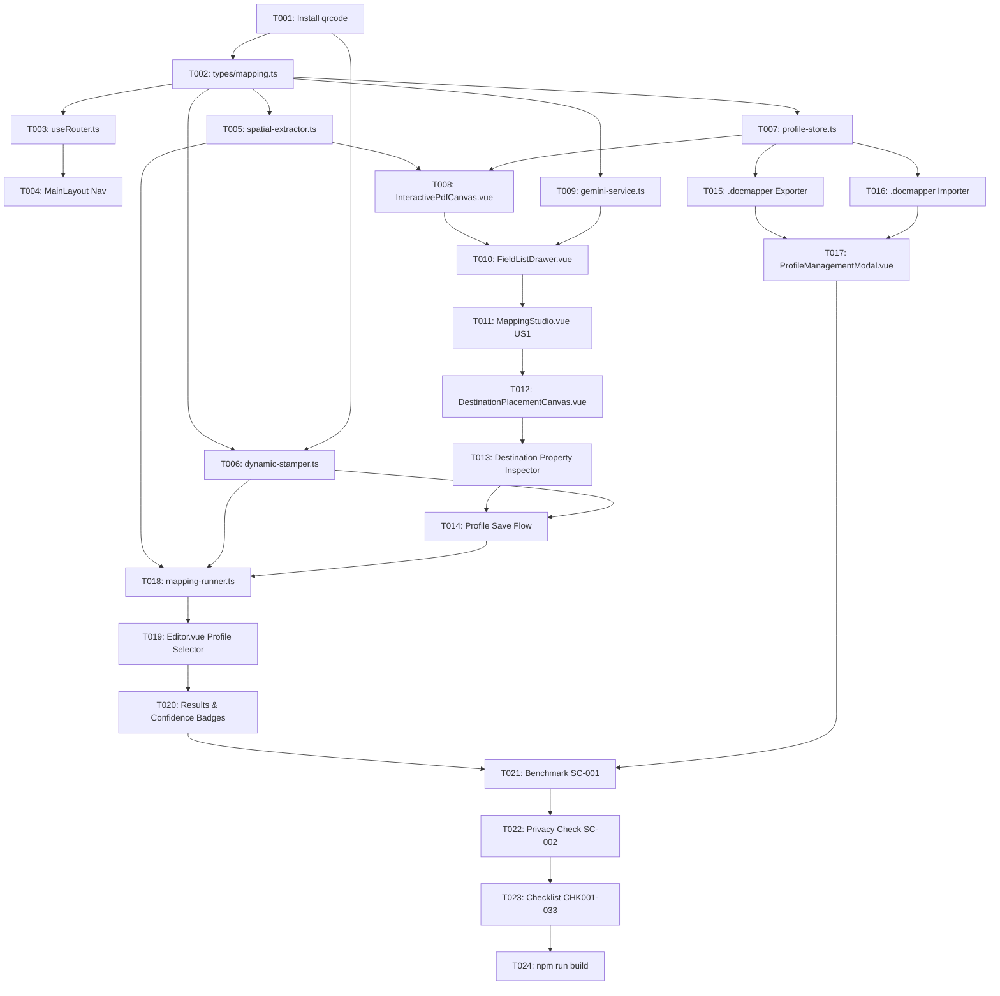

# Tasks: Visual Mapping Studio & LLM Pattern Extraction

**Branch**: `005-llm-extraction-and-mapping` | **Date**: 2026-10-08  
**Input**: [spec.md](file:///c:/Users/guilh/source/repos/Copyx/specs/005-llm-extraction-and-mapping/spec.md), [plan.md](file:///c:/Users/guilh/source/repos/Copyx/specs/005-llm-extraction-and-mapping/plan.md), [checklist.md](file:///c:/Users/guilh/source/repos/Copyx/specs/005-llm-extraction-and-mapping/checklist.md)  
**Status**: Completed (100%)

---

## Format: `[ID] [P?] [Story] Description`
- **[P]**: Can run in parallel (independent files or subsystems)
- **[Story]**: Mapped user story (`US1`, `US2`, `US3`, `US4`)
- Exact file paths referenced for all actions

---

## Phase 1: Setup & Shared Infrastructure

**Purpose**: Dependencies, contracts, and application routing foundation

- [x] T001 Install `qrcode` and `@types/qrcode` dependencies in `frontend/package.json`
- [x] T002 [P] Define core TypeScript contracts (`BoundingBox`, `FieldDefinition`, `DestinationFieldMapping`, `MappingProfile`, `ExtractionResult`) in `frontend/src/types/mapping.ts`
- [x] T003 [P] Implement client-side reactive router composable (`#/` and `#/mapping`) in `frontend/src/composables/useRouter.ts`
- [x] T004 Update header navigation in `frontend/src/components/layout/MainLayout.vue` and view switcher in `frontend/src/App.vue` for seamless tab navigation between Processor and Mapping Studio

---

## Phase 2: Foundational Services (Blocking Prerequisites)

**Purpose**: Core extraction, stamping, and persistence infrastructure that all user stories depend on

- [x] T005 Implement geometry-based text extraction engine using `pdfjs-dist` transformation matrices in `frontend/src/services/pdf/spatial-extractor.ts`
- [x] T006 [P] Implement dynamic PDF stamper in `frontend/src/services/pdf/dynamic-stamper.ts` using `pdf-lib`, supporting auto-fit text (8–14pt), Code 128 barcodes via `jsbarcode`, and QR codes via `qrcode`
- [x] T007 [P] Implement local profile storage and serialization in `frontend/src/services/mapping/profile-store.ts` (`localStorage` / `IndexedDB` CRUD, initial built-in CMR profile seeding)

**Checkpoint**: Core foundation ready — User Story components can now be built and tested.

---

## Phase 3: User Story 1 - Visual Field Mapping & LLM Pattern Generation (Priority: P1) 🎯 MVP

**Goal**: Allow operators to upload a sample PDF, draw paired Label and Value bounding boxes on an SVG canvas, and generate/test regex validation patterns via Gemini with manual fallback.

**Independent Test**: Upload a sample PDF on `/mapping`, draw boxes for "Shipment" and "Seal", generate rules via Gemini (or manual regex), and verify extracted text matches the pattern with 100% confidence.

- [x] T008 [US1] Create interactive SVG overlay canvas in `frontend/src/components/mapping/InteractivePdfCanvas.vue` supporting PDF rendering, page navigation, mouse drag-to-draw, corner-handle resizing, selection, and deletion of normalized bounding boxes `(x%, y%, w%, h%)`
- [x] T009 [P] [US1] Implement setup-only Google Gemini integration in `frontend/src/services/llm/gemini-service.ts` for regex mask & semantic type generation with structured JSON response schema and API key persistence in `localStorage`
- [x] T010 [US1] Create field management sidebar in `frontend/src/components/mapping/FieldListDrawer.vue` displaying defined fields, color-coded badges, extracted sample text, Gemini AI rule generator button, live regex test indicator, and manual pattern editing form
- [x] T011 [US1] Assemble Origin Document Mapping view in `frontend/src/views/MappingStudio.vue` binding canvas, spatial extractor, drawer, and Gemini service into a coherent setup workflow

**Checkpoint**: User Story 1 fully functional and testable independently on `/mapping`.

---

## Phase 4: User Story 2 - Destination Template Mapping & Profile Persistence (Priority: P1)

**Goal**: Allow operators to upload a destination PDF template, draw target placement boxes, choose render mode (Text, Code 128, QR Code), and save the complete mapping profile locally.

**Independent Test**: Upload destination PDF template, draw target boxes, select "Code 128 Barcode" for Shipment and "Text" for Seal, click "Save Profile", and verify profile is saved to local storage.

- [x] T012 [US2] Create destination template placement canvas in `frontend/src/components/mapping/DestinationPlacementCanvas.vue` allowing destination PDF upload, page navigation, target box drawing, and binding to defined origin fields
- [x] T013 [US2] Add destination field property inspector in `frontend/src/components/mapping/DestinationPlacementCanvas.vue` allowing selection of render format (`TEXT`, `CODE128`, `QR_CODE`) and font size preferences
- [x] T014 [US2] Integrate profile save & update flow in `frontend/src/views/MappingStudio.vue` persisting complete `MappingProfile` to `profile-store.ts`

**Checkpoint**: User Stories 1 AND 2 work together end-to-end to create and store complete mapping profiles.

---

## Phase 5: User Story 4 - Portable Profile Sharing (Priority: P1)

**Goal**: Export and import self-contained `.docmapper` files (including the destination PDF template encoded in Base64) with zero cloud dependencies and automatic collision deduplication.

**Independent Test**: Export a saved profile to `.docmapper`, clear browser storage or open a private window, import the `.docmapper` file, and verify all field rules and destination template are fully restored.

- [x] T015 [P] [US4] Implement `.docmapper` self-contained JSON packager and exporter in `frontend/src/services/mapping/profile-store.ts` (bundling field rules, spatial coordinates, and destination PDF template Base64)
- [x] T016 [P] [US4] Implement `.docmapper` importer with drag-and-drop / file picker and duplicate naming collision resolution (e.g. `Profile (1)`) in `frontend/src/services/mapping/profile-store.ts`
- [x] T017 [US4] Create Profile Management Hub modal in `frontend/src/components/mapping/ProfileManagementModal.vue` allowing operators to list, rename, duplicate, delete, and export/import profiles

**Checkpoint**: User Story 4 complete — profiles are 100% portable across workstations.

---

## Phase 6: User Story 3 - High-Speed Client-Side Runtime Execution (Priority: P1)

**Goal**: Process batches of PDFs client-side in milliseconds using saved mapping profiles, calculating confidence scores (0–100%) and generating filled delivery notes without any external LLM calls.

**Independent Test**: Select a custom profile in `Editor.vue`, upload 3 sample PDFs, verify processing completes locally in < 500ms/page with confidence score badges and downloadable generated PDFs and `summary.csv`.

- [x] T018 [US3] Implement batch runtime execution engine in `frontend/src/services/mapping/mapping-runner.ts` extracting text from mapped boxes, validating regex format patterns, calculating individual and document confidence scores (0–100%), and invoking `dynamic-stamper.ts`
- [x] T019 [US3] Update `frontend/src/views/Editor.vue` to add a Profile Selector dropdown, connecting chosen profiles to `mapping-runner.ts` while preserving built-in standard CMR processing as default
- [x] T020 [US3] Enhance output results view in `frontend/src/views/Editor.vue` displaying confidence score badges, document status, individual preview/download, and batch ZIP export including `summary.csv`

**Checkpoint**: All 4 User Stories (US1–US4) are fully implemented and integrated.

---

## Phase 7: Polish, Verification & Quality Assurance

**Purpose**: End-to-end verification, constitution compliance checks, and production build validation

- [x] T021 [P] Verify SC-001 performance benchmark (< 500ms per page runtime extraction)
- [x] T022 [P] Verify SC-002 privacy compliance (zero document data or customer profile data transmitted over network)
- [x] T023 Verify end-to-end user workflows against all 33 checklist items in `specs/005-llm-extraction-and-mapping/checklist.md` (CHK001 to CHK033)
- [x] T024 Run full build check (`npm run build`) in `frontend/` ensuring zero TypeScript errors, clean linting, and production asset bundling

---

## Dependencies & Execution Order

